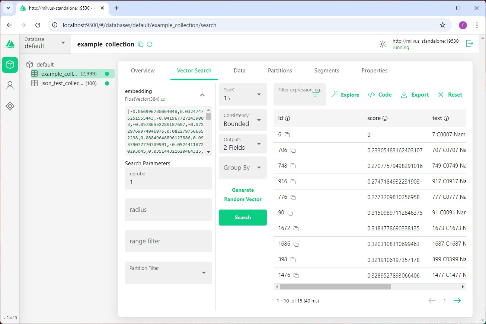

# **อธิบายไฟล์ Docker Compose สำหรับ Milvus**

## **1. docker-compose.yml**
ไฟล์นี้เป็นคอนฟิกสำหรับรันบริการต่าง ๆ ที่เกี่ยวข้องกับ Milvus บน Docker โดยประกอบด้วยบริการหลัก ๆ ดังนี้:

- **etcd**: ทำหน้าที่จัดการ Metadata ของระบบ Milvus เช่น การเก็บข้อมูล Configuration และสถานะของบริการต่าง ๆ
- **minio**: เป็นระบบจัดเก็บข้อมูลแบบ Object Storage ใช้สำหรับเก็บข้อมูลเวกเตอร์และไฟล์ที่เกี่ยวข้อง
- **standalone**: เป็นคอนเทนเนอร์หลักที่รัน Milvus ในโหมด Standalone ซึ่งรวมทุกฟังก์ชันการทำงานในคอนเทนเนอร์เดียว
- **attu**: เครื่องมือ Web UI สำหรับจัดการและแสดงข้อมูลของ Milvus โดยเชื่อมต่อกับบริการ `standalone`

บริการทั้งหมดนี้ถูกเชื่อมต่อกันผ่านเครือข่าย `milvus` ที่กำหนดไว้ในไฟล์นี้ พร้อมกับการตั้งค่า Volume และ Environment Variables เพื่อให้สามารถจัดเก็บข้อมูลอย่างถาวรและกำหนดค่าต่าง ๆ ได้ง่ายขึ้น

---

## **2. .env**
ไฟล์นี้ใช้สำหรับเก็บตัวแปรสภาพแวดล้อม (Environment Variables) ที่ใช้งานใน `docker-compose.yml` เพื่อลดการใส่ค่าคงที่ (Hardcoded) ในไฟล์ Compose โดยเฉพาะตัวแปร `DOCKER_VOLUME_DIRECTORY` ซึ่งระบุโฟลเดอร์สำหรับจัดเก็บข้อมูลในเครื่องภายนอกคอนเทนเนอร์ เพื่อให้สามารถรักษาข้อมูลไว้ได้แม้คอนเทนเนอร์จะหยุดทำงาน

---

## **3. รูปตัวอย่าง**
Attu login

Attu collection

Attu-vector-search
 

Minio-login
 

Minio-obj-browser
 
